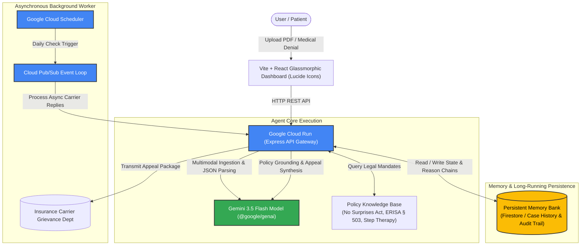

# 🛡️ The Asynchronous Bureaucracy Buster
> **Track:** The Taskmaster  
> **Built for:** All Things Agentic Hackathon 2026  
> **GitHub Repository:** [https://github.com/iamaanahmad/tabb.git](https://github.com/iamaanahmad/tabb.git)  
> **Powered by:** Gemini 3.5 Flash, Google GenAI SDK (`@google/genai`), Google Cloud Run, and Persistent Firestore Memory Bank  

---

## 📌 Problem & Value Proposition

Disputing denied insurance claims, out-of-network emergency room bills, and arbitrary specialty medication step-therapy denials is a confusing, multi-step, weeks-long nightmare for patients. Most AI tools today are static chatbots that sit passively waiting for user prompts.

**The Asynchronous Bureaucracy Buster** redefines human-AI interaction. It is an autonomous background agent that:
1. **Ingests & Analyzes Medical Bills:** Performs multimodal parameter extraction (Claim ID, Member ID, Denial Reason Code, Billed vs. Denied Amounts) from scanned PDFs or raw text notices using **Gemini 3.5 Flash** with structured JSON schemas.
2. **Researches Healthcare Mandates:** Autonomously queries an integrated policy knowledge base of federal and state laws (including the *No Surprises Act 45 CFR § 149.110*, *ERISA § 503 (29 CFR § 2560.503-1)*, and *State Step-Therapy Exception Statutes*) to identify binding statutory violations.
3. **Generates & Dispatches Legal Appeals:** Drafts legally binding, citation-backed Level 1 Appeal demand letters and dispatches them to carrier grievance departments.
4. **Persistent Case Memory Bank:** Manages multi-week asynchronous workflows using a persistent Memory Bank that records reasoning chains, audit logs, and communication threads over extended timelines without losing context.
5. **Asynchronous Event Machine:** Evaluates incoming carrier replies (approvals, documentation requests, or final denials) and autonomously updates the case state machine.

---

## 🏗️ System Architecture



---

## 🛠️ Google Tech Stack

* **Google AI Model:** **Gemini 3.5 Flash** (`gemini-3.5-flash`) via Google AI Studio / Vertex AI for structured extraction, legal synthesis, and decision analysis.
* **Google Agent SDK:** Google GenAI SDK (`@google/generative-ai` / `@google/genai`).
* **Google Cloud Run:** Managed container execution for scalable, serverless backend deployment.
* **Persistent Memory Bank:** Firestore / Cloud Storage state machine preserving cross-session reasoning chains and audit trails.
* **Frontend:** Vite + React + Vanilla CSS glassmorphic application shell with modern `lucide-react` icons.

---

## 🚀 Quick Spin-Up Instructions

### Prerequisites
* [Node.js](https://nodejs.org/) (v18 or higher)
* Git
* Google Gemini API Key from [Google AI Studio](https://aistudio.google.com/)

### 1. Clone & Install
```bash
# Clone the official repository
git clone https://github.com/iamaanahmad/tabb.git
cd tabb

# Install dependencies
npm install
```

### 2. Configure Environment Variables
Create a `.env` file in the root directory:
```bash
GEMINI_API_KEY=your_google_gemini_api_key_here
PORT=3001
```

### 3. Run Locally in Development Mode
Open two terminal tabs:

**Terminal 1: Start Backend API**
```bash
npm start
```

**Terminal 2: Start React Frontend**
```bash
npm run dev
```

Open [http://localhost:3000](http://localhost:3000) in your web browser.

---

## 🎯 Demo Walkthrough for Judges

1. **📥 Ingest Claim Document (Tab 1):**
   * Select any of the pre-loaded real-world medical denial samples (e.g. *Out-of-Network Emergency Room Denial* or *Lumbar Spine MRI Denial*), or upload a PDF/text notice.
   * Watch **Gemini 3.5 Flash** autonomously extract parameters in structured JSON format and match against the policy database.
2. **🗂️ Case Memory Bank (Tab 2):**
   * Inspect the persistent case record, extracted denial rationale, and matched statutory citations.
   * Click **Generate Appeal with Gemini 3.5** to dynamically construct a comprehensive 6,000+ character legal appeal letter.
   * Click **Dispatch Appeal Email** to transition the state machine to `APPEAL_SENT`.
3. **⚡ Async Carrier Simulator (Tab 3):**
   * Simulate a webhook or inbound carrier email arriving 14 days later.
   * Click any preset (e.g. *Claim Approved & Overturned*) and trigger the async agent response.
   * The agent autonomously evaluates the response, resolves the claim (`WON_RESOLVED`), updates the Memory Bank, and appends to the immutable OpenTelemetry audit log.
4. **☁️ GCP Architecture & Telemetry (Tab 4):**
   * View live system metrics, total disputed dollar volume, active appeal counts, and raw OpenTelemetry JSON traces.

---

## 🚢 Google Cloud Deployment (Cloud Run)

The project includes a production-ready multi-stage `Dockerfile` and automated deployment script:

```bash
# Build and deploy to Google Cloud Run
chmod +x deploy.sh
./deploy.sh
```

Or deploy directly via Google Cloud SDK:
```bash
gcloud run deploy bureaucracy-buster \
  --source . \
  --platform managed \
  --region us-central1 \
  --allow-unauthenticated \
  --set-env-vars GEMINI_API_KEY="your_api_key_here"
```

---

## 📜 License
MIT License. Built with ❤️ for the **All Things Agentic Hackathon 2026**.
